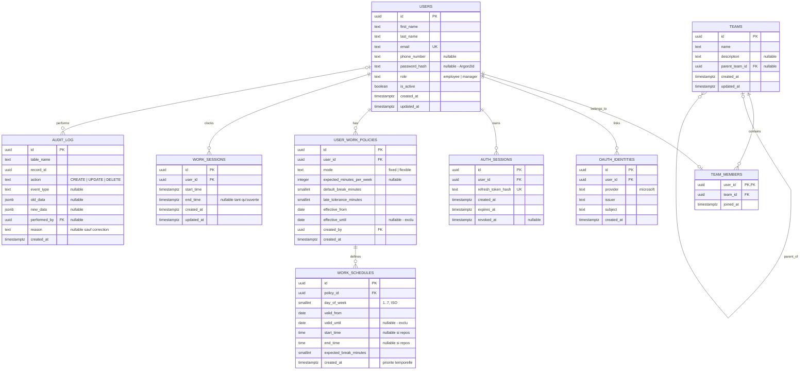
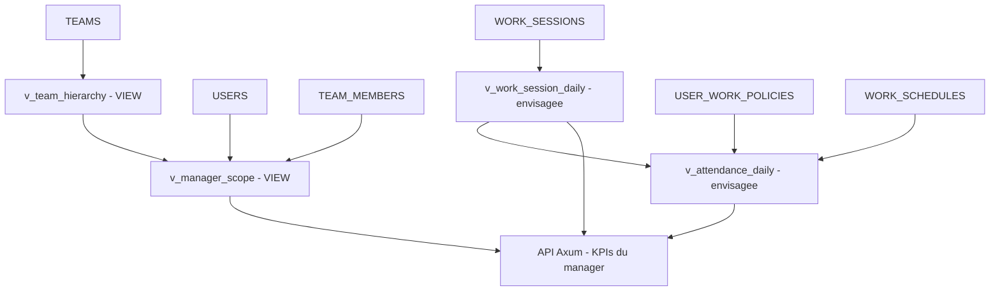

# Time Manager — Architecture BDD retenue

> Proposition consolidée des décisions d'équipe au **9 octobre 2026**, à valider techniquement avant les migrations SeaORM. PostgreSQL, Axum/SeaORM, React web et React Native prévu.
>
> Périmètre volontaire : **une pointeuse**, pas un ERP/RH. On ne suit pas obligatoirement la nature d'un congé, les droits à congés ou les pièces justificatives.

## Décisions actées

- **9 tables**, et non 10 : `WORK_SCHEDULE_OVERRIDES` a été supprimée. Aucun `LOCAL_CREDENTIALS`, `WORK_SESSION_CORRECTIONS` ou `manager_id` dans les équipes.
- Un compte a au plus **une équipe**, portée par `TEAM_MEMBERS`. Son rôle `employee`/`manager` est dans `USERS`. Plusieurs managers peuvent appartenir à une même équipe.
- Un manager voit son équipe et toutes ses équipes descendantes. Il corrige ses employés de même équipe et les membres des sous-équipes, **mais pas un manager pair de la même équipe**. Il ne peut se corriger lui-même **que si son équipe est racine**. Chaque manager peut pointer pour lui-même.
- `USER_WORK_POLICIES` porte les règles datées (`fixed`/`flexible`, objectif hebdomadaire, tolérance). `WORK_SCHEDULES` porte les journées théoriques. `WORK_SESSIONS` porte les intervalles réellement pointés.
- **Un schedule = une règle pour une journée**, pas pour chaque session matin/après-midi : un lundi prévu `08:00–18:00` avec `expected_break_minutes=60` et deux sessions réelles `08:00–12:00`, `13:00–18:00`.
- Les règles horaires peuvent se **chevaucher dans leur validité**. La règle **créée le plus récemment parmi celles applicables au jour considéré** est choisie. Une règle temporaire expirée rend automatiquement la main à une règle plus ancienne encore applicable. Une modification crée une **nouvelle ligne** : on ne réécrit pas `created_at`.
- Début et fin `NULL` **ensemble** dans un schedule = aucun travail attendu pour cette journée. Pas de type de congé conservé : c'est intentionnel.
- Les pauses sont **explicitement pointées** par arrêt/reprise des sessions ; `expected_break_minutes` conserve la durée prévue. Les trous entre sessions ne prouvent pas automatiquement qu'il s'agit de pauses déjeuner.
- Microsoft Entra / OIDC + mot de passe local (hash Argon2id côté backend). Comptes créés par un manager, sans inscription libre. `AUTH_SESSIONS` permet refresh et révocation ; `AUDIT_LOG` retrace les corrections.

## Diagramme ER — modèle définitif proposé



## Diagramme des vues et des calculs



**Les deux vues `v_team_hierarchy` et `v_manager_scope` sont définies dans `views.sql`.** Les deux vues journalières sont des projections proposées, **non implémentées ici** : leur calcul dépend de décisions restantes sur fuseau, journées à cheval sur minuit et analyse des absences. Pour les KPIs demandant une période précise, une requête SQL paramétrée (ou une fonction SQL) est souvent plus propre qu'une vue globale générant toutes les dates.

## Fonctionnement par table

### `USERS`
Identité métier stable. `password_hash` est nullable pour un compte précréé par un manager et activé ultérieurement ou pour une connexion uniquement Microsoft. L'unicité de l'email est assurée par un index sur `lower(email)` ; `is_active=false` permet de désactiver sans effacer les pointages. Les mots de passe arrivent au backend via HTTPS et y sont hashés Argon2id. `updated_at` doit être mis à jour par le backend ou un trigger : `DEFAULT now()` ne le fait pas automatiquement.

### `OAUTH_IDENTITIES`
Correspondance entre le compte interne et l'identité OIDC Microsoft (`provider`, `issuer`, `subject`). Contrainte d'unicité sur ce triplet. **Ne pas relier automatiquement les comptes par simple égalité d'email.**

### `AUTH_SESSIONS`
Sessions de refresh révocables. Stocker le hash du token, sa durée de vie et son éventuelle révocation. La rotation d'un token est une opération transactionnelle dans Axum ; accès web par cookies sécurisés, mobile par stockage sécurisé du terminal.

### `TEAMS`
Liste d'adjacence (`parent_team_id` facultatif). Les branches se parcourent par CTE récursive ou via la vue `v_team_hierarchy`. Interdire les cycles, y compris concurrentiels : le `CHECK parent_team_id <> id` seul ne suffit pas. La hiérarchie des droits est **déduite**, aucun `manager_id`.

### `TEAM_MEMBERS`
`user_id` clé primaire interdit plusieurs affectations simultanées. Un manager manage *son équipe* et sa descendance. Les pairs managers dans une même équipe n'ont aucun droit de correction mutuel. Une équipe racine autorise uniquement ses **managers** à s'autocorriger. À ce stade, les mutations écrasent l'appartenance historique : les KPI passés peuvent donc refléter l'organigramme actuel.

### `USER_WORK_POLICIES`
Version datée des règles d'horaires (`fixed`, `flexible`), objectif hebdomadaire, tolérance, pause de référence par défaut. Une seule policy peut s'appliquer à un utilisateur à une date donnée. Les périodes sont **[début inclus, fin exclue)**. Les schedules associés doivent rester dans la validité de leur policy. La pause par défaut n'est pas à déduire une seconde fois des heures réellement pointées.

### `WORK_SCHEDULES`
**La table unifiée des journées prévues**, habituelles ou temporaires : chaque ligne s'applique au jour ISO indiqué pendant `[valid_from, valid_until)`. Un `NULL/NULL` pour les heures signifie *aucun travail attendu* ; dans ce cas `expected_break_minutes=0`.

La journée de travail théorique est la plage `start_time -> end_time`, déduction faite de `expected_break_minutes`. Un horaire qui traverse minuit est possible en interprétant `end_time < start_time` comme une fin le lendemain. La limite est une amplitude strictement inférieure à 24 h.

Un nouvel horaire ajoute une ligne, y compris pour les modifications. Les anciennes règles restent valides sous la nouvelle règle, qui gagne **si elle est applicable au même jour** et plus récemment créée. Pour un congé d'une journée entière, créer une règle `NULL/NULL` datée ; pour une demi-journée, créer la plage qui reste travaillée. Aucun motif RH n'est exigé.

**Requête de résolution** (simplifiée : la policy du jour a déjà été sélectionnée) :

```sql
SELECT ws.*
FROM work_schedules ws
WHERE ws.policy_id = $1
  AND ws.day_of_week = EXTRACT(ISODOW FROM $2::date)::int
  AND ws.valid_from <= $2::date
  AND (ws.valid_until IS NULL OR ws.valid_until > $2::date)
ORDER BY ws.created_at DESC, ws.id DESC
LIMIT 1;
```

`id DESC` ne remplace pas un vrai ordre de création en cas d'égalité de timestamp : pour rendre l'ordre métier strict (notamment quand plusieurs horaires sont créés dans une même transaction), il faudra soit **refuser les égalités conflictuelles**, soit introduire à terme une révision monotone. Ne pas présenter le tri UUID comme un horodatage.

### `WORK_SESSIONS`
Une ligne = une période continue réellement pointée. Ex. matin `08–12`, après-midi `13–18`. La pause est le temps non pointé entre périodes, **pas automatiquement une pause déjeuner prouvée**. Une session ouverte a `end_time=NULL`. PostgreSQL empêche les sessions chevauchantes et les doubles ouvertures. Les KPI de pause sont indicatifs sans motif de sortie.

### `AUDIT_LOG`
Historique générique old/new JSONB, auteur, événement métier et justification. Une correction managériale des pointages doit avoir `event_type='WORK_SESSION_CORRECTED'` et un `reason` non vide. Faire écriture + audit dans **une transaction** ; rendre l'audit append-only au niveau des privilèges applicatifs. Les comptes ne devraient pas être supprimés brutalement si leurs écritures doivent rester retraçables.

## Pourquoi cette architecture (et pourquoi pas les alternatives)

| Décision | Justification / limite assumée |
|---|---|
| **Pas d'overrides** | Les horaires temporaires et les repos sont déjà des règles horaires datées : pas de seconde source de vérité ni de limite arbitraire de 48 h. |
| **Un schedule = une journée** | Evite de chercher quel créneau matin/après-midi une nouvelle règle doit remplacer ; les sessions réelles restent multiples. |
| **Dernière création applicable gagnante** | Pas de découpe ni copie des autres jours ; un horaire temporaire expire et révèle l'ancien. **Contrepartie :** un nouveau planning général peut masquer une ancienne exception future. |
| **Insertion à chaque modification** | Le `created_at` ne change pas de sens ; règles historiques conservées. **Contrepartie :** des insertions rétroactives peuvent modifier les KPI historiques si les périodes passées sont autorisées. |
| **Policy séparée du planning** | Les objectifs et tolérances n'ont pas à être répétés sept fois ; périodes de règles différentes conservables. |
| **Pas de suivi RH des congés** | `NULL/NULL` encode « pas attendu ». Ne distingue pas congé payé, RTT, arrêt maladie ; c'est volontaire. |
| **Pas de table de corrections** | Audit JSONB général suffisant si justification, identité et atomicité garanties. |
| **Vues non matérialisées** | Le périmètre de droits doit suivre immédiatement un changement d'organigramme ; les agrégats lourds pourront être optimisés plus tard. |

## Conditions de validation avant `sea-orm-migration`

1. **Préciser le fuseau horaire métier**, notamment pour les horaires nocturnes et la date locale d'un pointage.
2. **Garantir l'absence de cycles** dans l'arbre des équipes, y compris en cas de réorganisation concurrente.
3. **Garantir l'ordre des règles de même timestamp**, ou refuser une publication simultanée concurrente pour un même jour/période.
4. **Fixer la politique rétroactive** : est-on autorisé à publier un horaire applicable à une date passée ? Sinon le bloquer côté Axum. Sinon les KPI historiques peuvent être recalculés.
5. **Contrôler les FK sur la durée des policies et schedules** : une règle horaire ne doit pas dépasser la validité de sa policy, ou la logique doit la tronquer.
6. **Tester l'accès manager/manager**, l'autogestion racine, les changements d'équipe et les sessions qui traversent minuit.
7. **Préciser suppression/rétention des comptes et audit** selon le sujet et les règles applicables.
8. **Confirmer la règle souple/fixe** : une policy flexible sans schedule impose seulement un objectif hebdomadaire ; pas d'alerte de retard sans horaire prévu.

## Proposition d'implémentation

1. Migration SeaORM pour les tables et index/contraintes (les parties PostgreSQL spécifiques peuvent passer en SQL brut).
2. Migration distincte pour les vues de hiérarchie/périmètre.
3. Services Axum transactionnels : validation de droits, changement des règles de planning, correction des pointages avec audit.
4. Tests d'intégration PostgreSQL sur les cas temporels et hiérarchiques ci-dessus.
5. KPIs journaliers paramétrés ensuite, sur le modèle **prévu vs effectivement pointé** et sans assimiler automatiquement un trou à un congé ou une pause.
