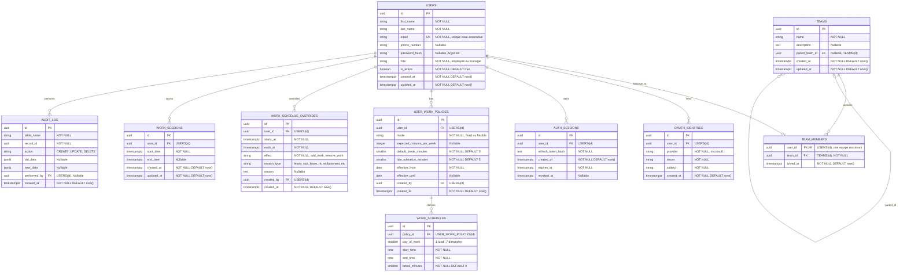

```mermaid
erDiagram
    direction TB

    USERS {
        uuid id PK
        string first_name "NOT NULL"
        string last_name "NOT NULL"
        string email UK "NOT NULL, unique case-insensitive"
        string phone_number "Nullable"
        string password_hash "Nullable, Argon2id"
        string role "NOT NULL, employee ou manager"
        boolean is_active "NOT NULL DEFAULT true"
        timestamptz created_at "NOT NULL DEFAULT now()"
        timestamptz updated_at "NOT NULL DEFAULT now()"
    }

    OAUTH_IDENTITIES {
        uuid id PK
        uuid user_id FK "USERS(id)"
        string provider "NOT NULL, microsoft"
        string issuer "NOT NULL"
        string subject "NOT NULL"
        timestamptz created_at "NOT NULL DEFAULT now()"
    }

    AUTH_SESSIONS {
        uuid id PK
        uuid user_id FK "USERS(id)"
        text refresh_token_hash "NOT NULL"
        timestamptz created_at "NOT NULL DEFAULT now()"
        timestamptz expires_at "NOT NULL"
        timestamptz revoked_at "Nullable"
    }

    TEAMS {
        uuid id PK
        string name "NOT NULL"
        text description "Nullable"
        uuid parent_team_id FK "Nullable, TEAMS(id)"
        timestamptz created_at "NOT NULL DEFAULT now()"
        timestamptz updated_at "NOT NULL DEFAULT now()"
    }

    TEAM_MEMBERS {
        uuid user_id PK,FK "USERS(id), une equipe maximum"
        uuid team_id FK "TEAMS(id), NOT NULL"
        timestamptz joined_at "NOT NULL DEFAULT now()"
    }

    USER_WORK_POLICIES {
        uuid id PK
        uuid user_id FK "USERS(id)"
        string mode "NOT NULL, fixed ou flexible"
        integer expected_minutes_per_week "Nullable"
        smallint default_break_minutes "NOT NULL DEFAULT 0"
        smallint late_tolerance_minutes "NOT NULL DEFAULT 5"
        date effective_from "NOT NULL"
        date effective_until "Nullable"
        uuid created_by FK "USERS(id)"
        timestamptz created_at "NOT NULL DEFAULT now()"
    }

    WORK_SCHEDULES {
        uuid id PK
        uuid policy_id FK "USER_WORK_POLICIES(id)"
        smallint day_of_week "1 lundi, 7 dimanche"
        time start_time "NOT NULL"
        time end_time "NOT NULL"
        smallint break_minutes "NOT NULL DEFAULT 0"
    }
    
    WORK_SCHEDULE_OVERRIDES {
        uuid id PK
        uuid user_id FK "USERS(id)"
        timestamptz starts_at "NOT NULL"
        timestamptz ends_at "NOT NULL"
        string effect "NOT NULL, add_work, remove_work"
        string reason_type "leave, sick_leave, rtt, replacement, etc"
        text reason "Nullable"
        uuid created_by FK "USERS(id)"
        timestamptz created_at "NOT NULL DEFAULT now()"
    }

    WORK_SESSIONS {
        uuid id PK
        uuid user_id FK "USERS(id)"
        timestamptz start_time "NOT NULL"
        timestamptz end_time "Nullable"
        timestamptz created_at "NOT NULL DEFAULT now()"
        timestamptz updated_at "NOT NULL DEFAULT now()"
    }

    AUDIT_LOG {
        uuid id PK
        string table_name "NOT NULL"
        uuid record_id "NOT NULL"
        string action "CREATE, UPDATE, DELETE"
        jsonb old_data "Nullable"
        jsonb new_data "Nullable"
        uuid performed_by FK "USERS(id), Nullable"
        timestamptz created_at "NOT NULL DEFAULT now()"
    }

    USERS ||--o| TEAM_MEMBERS : belongs_to
    TEAMS ||--o{ TEAM_MEMBERS : contains
    TEAMS o|--o{ TEAMS : parent_of

    USERS ||--o{ OAUTH_IDENTITIES : links
    USERS ||--o{ AUTH_SESSIONS : owns

    USERS ||--o{ USER_WORK_POLICIES : has
    USER_WORK_POLICIES ||--o{ WORK_SCHEDULES : defines
    USERS ||--o{ WORK_SCHEDULE_OVERRIDES : overrides

    USERS ||--o{ WORK_SESSIONS : clocks

    USERS ||--o{ AUDIT_LOG : performs
```