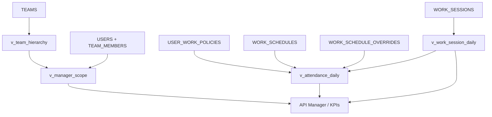

```mermaid
flowchart TB
    T["TEAMS"] --> H["v_team_hierarchy"]
    H --> S["v_manager_scope"]
    U["USERS + TEAM_MEMBERS"] --> S

    WS["WORK_SESSIONS"] --> D["v_work_session_daily"]
    P["USER_WORK_POLICIES"] --> A["v_attendance_daily"]
    SCH["WORK_SCHEDULES"] --> A
    O["WORK_SCHEDULE_OVERRIDES"] --> A
    D --> A

    S --> KPI["API Manager / KPIs"]
    A --> KPI
    D --> KPI
```